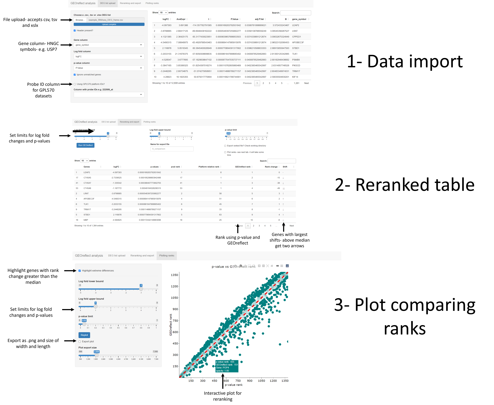

# GEOreflect- leveraging pre-existing microarray and RNA-seq datasets to improve the biological interpretability of differential expressed gene (DEG) analysis

## A R shiny app and command line interface for reranking DEG lists from microarray and RNA-seq datasets
A large scale metanalysis of microarray and RNA-seq platforms has identified a subset of genes with higher propensity for differential expression irrespective of the tissue used or the experiment used and current approaches to ranking DEGs solely focus on the relative significance of a gene's p-value to other genes without accounting for this and this may obscure more relevant DEGs. 
\\
GEOreflect in contrast combines the relative significance of a given gene both within the study of interest and when compared to pre-existing studies when ranking the most relevant genes. This in turn accounts for genes intrinsic propensity for differential expression alongside its relative significant to other genes within the study of interest. To use the R shiny app for this DEG ranking method install the dependencies- six in total and are installed using the script below.
```R
if("shiny" %in% rownames(installed.packages()) == FALSE){
  install.packages("shiny", quiet= T)}
if("openxlsx" %in% rownames(installed.packages()) == FALSE){
  install.packages("openxlsx", quiet= T)}
if("shinyFiles" %in% rownames(installed.packages()) == FALSE){
  install.packages("shinyFiles", quiet= T)}
if("DT" %in% rownames(installed.packages()) == FALSE){
  install.packages("DT", quiet= T)}
if("ggplot2" %in% rownames(installed.packages()) == FALSE){
  install.packages("ggplot2", quiet= T)}
if("plotly" %in% rownames(installed.packages()) == FALSE){
  install.packages("plotly")}
```
Once done download the RDS images of the percentile frames used to rerank genes. Once downloaded- in the terminal ```git clone brandoncoke::GEOreflect``` then decompress the zip file. Insert the .RDS files into the GEOreflect directory load the R interpreter and type.
```R
setwd('~/GEOreflect')
runApp('app_and_gpl570.R') 
#alternatively use 
#runApp('app.R') 
```
The app has 3 tabs- the data import, reranking table and plotting tab. The app accepts DEG lists formatted as .csvs, .txt, .tsv and .xslx. Once imported- select the gene, log fold and p-value columns. If you are working with GPL570 microarray data you will also need the probe ID column. Once selected- run GEOreflect by clicking the 'Run GEOreflect' button. You export the reranked list into the working directory- the GEOreflect directory. The third tab contains the plot which can be produced by either clicking the 'Replot' button or on the second tab the 'Plot reranks' box. This plot can be exported by selecting the 'Export plot' box or using the interactive plotly plot on the side and clicking the print icon in the top right.

Alternatively, the functions for the GPL570 and RNA-seq GEOreflect reranking can found in the GEOreflect_funcitons.R file. This only requires the percentile frames to be loaded into the environment- i.e. load("percentile_matrix_p_value_RNAseq.RDS").
